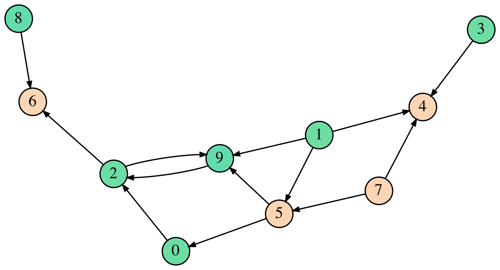
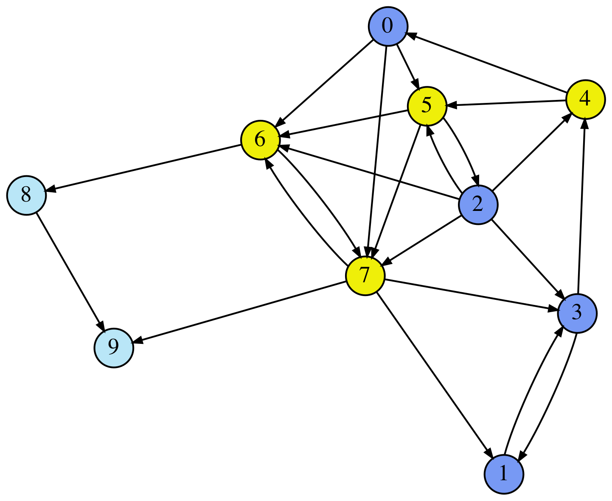

 
  

# Bisimulation-Algorithms

## The problem
Let's consider a graph G=(V,E). A *bisimulation* on G is a binary relation on V which satisfies the following property:

This is in fact a condition on the *behavior* of the nodes: two nodes *behave* in the *same way* if for each node reached by one of them, there's a fourth node reached by the other node which *behaves* like the third.

This informal definition of bisimulation is equivalent to the formal one above, but it's somewhat more explicit.

## Algorithmic approach
The somewhat recursive statement of the problem makes the bisimulation an apparently difficult problem from an algorithmic point of view. However, as Kanellakis C. and Smolka S. shown in their paper published in 1990, computing the *maximum* bisimulation of a graph (namely the *biggest* bisimulation, the one which relates the highest number of nodes) is equivalent to determining the *relational stable coarsest partition*.

The *RSCP* of a set S given a binary relation R, as the name suggests, is the *coarsest* (which contains the fewest number of blocks) *stable partition*, where *stability* is a quality of partitions defined as follows for a given partition P:

This statemente is reassuring: in order to verify that two nodes are *bisimilar* (which is quite interesting for the applications) we do not need to visit exhaustively their children, and then the children of the children, and so on. We only need to compute the RSCP of V with respect to the relation E, and check whether the two nodes are in the same block.

## Algorithms
This library contains the implementation in Python 3 of the following algorithms:
|  Name        |  Strategy   | Complexity  |
|--------------|:-------------:|:---:|
| Paige-Tarjan | Negative    |   |
| Dovier-FBA   | Negative    |   |
| Saha         | Incremental |  Depends on the entity of the changes. |

## Examples
Partizione iniziale | RSCP
--- | ---
 | 
 | 

(Nodes in the same partition have the same color)

## Applications
Work in progress.
